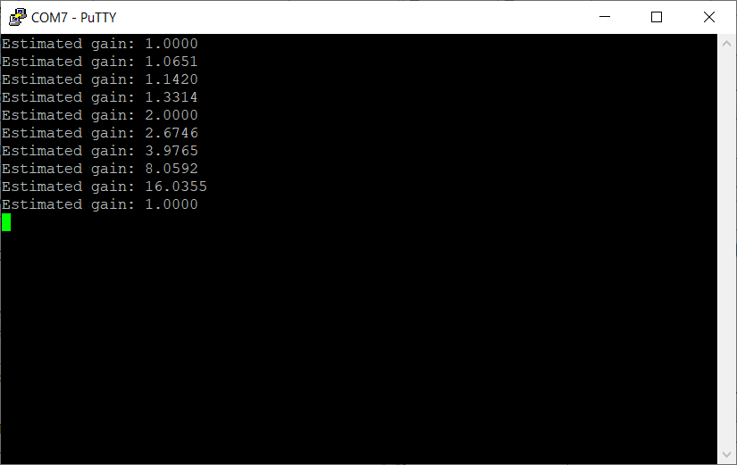
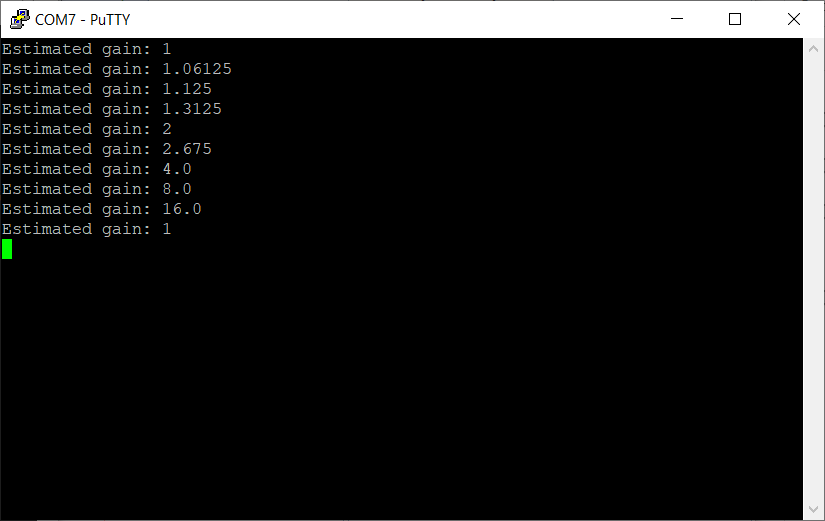

<!-- Please do not change this html logo with link -->

# Gain measurement of the OPA module on PIC18F16Q41
This code example measures the gain of the Operational Amplifier (OPA) module on the PIC18F16Q41. Internally, this project uses the ADCC on the device to sample both the input, which is derived from a DAC, and the output, then computes the gain using either fixed point or floating point numbers.

## Related Documentation
TBxxxx, "Using Operational Amplifiers in PIC16 and PIC18" 

The tech brief above will be published soon.
## Software Used

* <a href="http://www.microchip.com/mplab/mplab-x-ide">MPLAB® IDE 5.40 or newer</a>
* <a href="https://www.microchip.com/mplab/compilers">Microchip XC8 Compiler 2.20 or newer</a>
* <a href="https://www.microchip.com/mplab/mplab-code-configurator">MPLAB® Code Configurator (MCC) 3.95.0 or newer</a>
* Serial Terminal

## Hardware Used

* <a href="https://www.microchip.com/wwwproducts/en/PIC18F16Q41">PIC18F16Q41 Product Information</a> 
* <a href="https://www.microchip.com/DevelopmentTools/ProductDetails/PartNO/DM164137"> Microchip Curiosity Development Board (DM164137) </a>

## Setup
#### Wiring

 
*Figure 1 - Wiring Image (pin tables included below)*

| Wire    | Name                | Description
| ------- | ------------------- | -----------
| Orange  | UART Transmit       | UART TX (9600 BAUD)
| Blue    | OPA1OUT             | Output of the operational amplifier

#### External Pins

| Pin | Name     | Description
| --- | -------- | -----------
| RB7 | UART TX  | UART TX (9600 BAUD)
| RB5 | OPA1IN0+ | Input to the OPA module1
| RC2 | OPA1OUT  | Output of the operational amplifier

Note:
1. RB5 is used so that the output is equal to gain x input. Input should be < 300mV to properly calculate the 16x range.

#### Curiosity Board Parts

| Pin | Function
| --- | --------
| RA2 | LED D6 - Measuring indicator LED
| RA5 | LED D4 - Timing Indicator1

**Note** 
1. This pin is used as a tool to show that floating points are much slower than fixed point operations. LED is on when division is occurring. Integrate the active time of the waveform to find the difference in time.

#### Additional Pins

| Pin | Function
| --- | --------
| TX | Curiosity board UART transmit pin. Connect to RB7

## Operation
Out of the box, this program does automatic gain switching to demonstrate the measurements. Every time the program prints the current gain, it changes the gain.

The order of the gains is 1 (Unity Gain), 16/15, 8/7, 4/3 , 2, 8/3, 4, 8, and then 16.

During conversion and printing, LED D6 is on. It should appear as a brief blink every 10 seconds.
The gain calculated is printed through the UART at 9600 baud.

The program can be run in fixed point or floating point mode - in fixed point, resolution is limited is limited to +- 0.0625, but the code is much faster and much smaller. In floating point mode, resolution is much better, but the program is much bigger and slower.

The default configuration is floating point mode.

 
*Figure 2 - Floating Point Measurement*

 
*Figure 3 - Fixed Point Measurement*

### Program Defines
There are 2 define statements in this example which can be used to change the behavior of the code example. Both define statements are present in the file "OPAconfig.h".

- **ENABLE_CHANGING_GAIN**
  - This option disables the gain switching demo on the code example. For correct operation, this option **must be disabled** when using external resistors (1). Gain measurement limit is 999.

- **ENABLE_FLOATING_PT**
  - This option selects the use of floating points for gain calculation, rather than fixed point numbers. Enabling this option provides an increase in the accuracy of the gain measurement, however it significantly increases code size and computation time.

**Note:**
  1. To use external gain resistors, a reconfiguration of the OPA module in MCC is required.

## Summary
This example shows the programmable gain functionality of the OPA module, and then measures the gain of the amplifier.

<!-- Summarize what the example has shown -->
